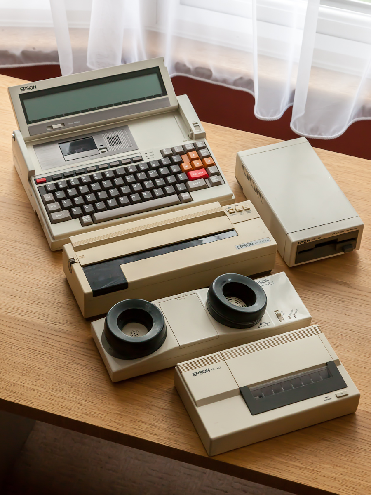

# HX-40 客制化机械键盘

## 目录

- [产品介绍](#产品介绍) 

- [产品参数](#产品参数) 

- [产品实拍](#产品实拍)

## 产品介绍

 都说时尚是个圈，所以我们决定——

 回到工业设计的黄金年代，寻找现在与过去相连接的时代密码。

 于是 HX-40 诞生了，

 它是一款复古风格的40%配列机械键盘。

 这款键盘的设计灵感源自 EPSON 于上世纪推出的 HX - 20、PX - 8、P - 40 等传奇产品。

 这些在当时堪称先锋的设备，不仅是科技进步的见证，更以其独特的工业设计美学，在便携式设备的发展史上留下了浓墨重彩的一笔。

  

 复古从来不是简单的复刻，

 在当下或许应该更多考虑的是——“现在与过去的对话”？

 在 HX-40 中，我们选择将 HX-20 与 PX-8 的原始配列进行结合，

 结合其便携式设备的特点，将其配列进行 “40%化” 改造。

 用 40% 的精简布局，收纳 100% 的时光温度。

 

 

 或许在某一个阳光明媚的午后，

 你会发现，

 你在键盘上的每一个按键，

 都与过去的时光相连接。

 这时我们或许会明白，

 或许所谓复古风潮，就是让每个时代的人，都能在全新的产品上触摸到属于自己的「黄金年代」的记忆。

 

 

 

 

## 产品参数

产品尺寸：262x134mm（投影尺寸）

前高：12mm（含前高处大倒角，实际前高18mm）

键入角度：7°

内部结构：Top Mound

固件：QMK

支持的特殊键位：阶梯Caps、分裂空格

支持连接方式：有线、蓝牙、2.4G

价目表：

 

## 产品实拍

 

 

 

 
